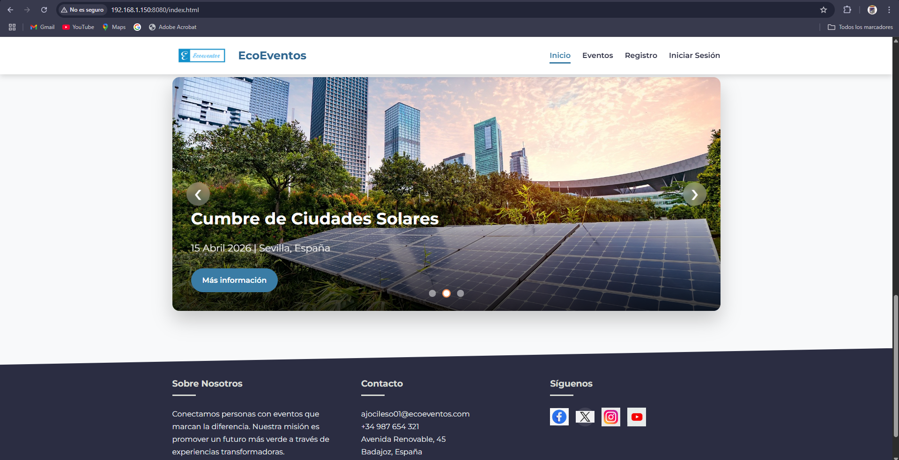
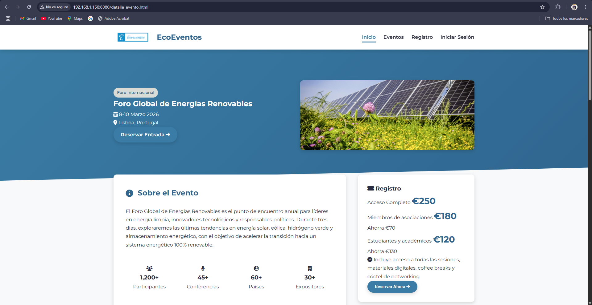
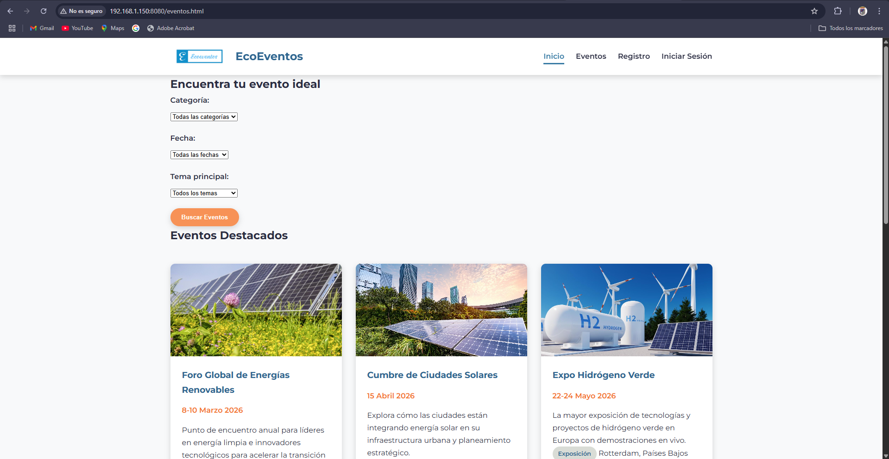
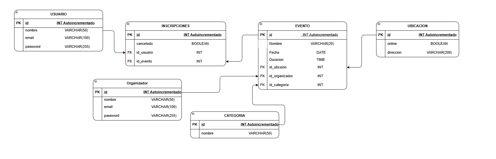
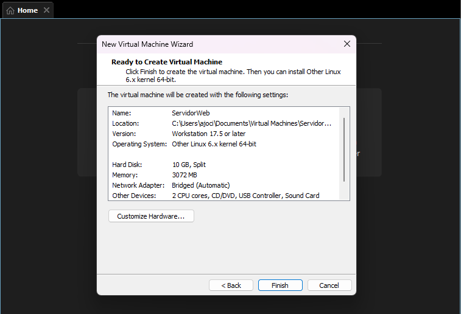
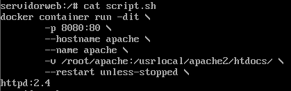
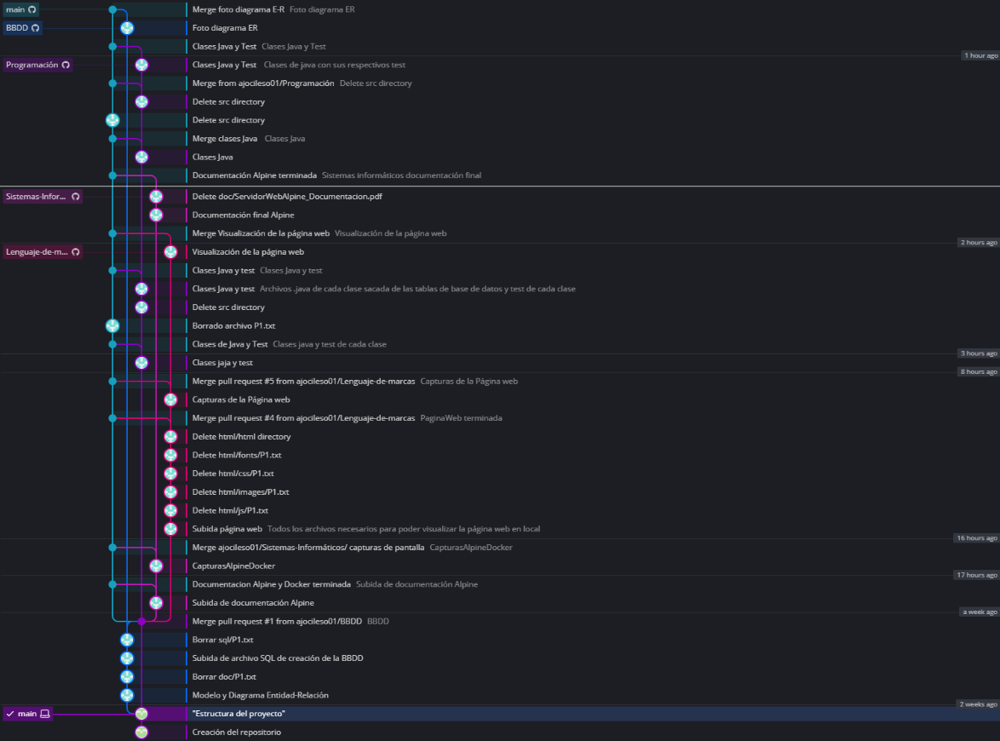
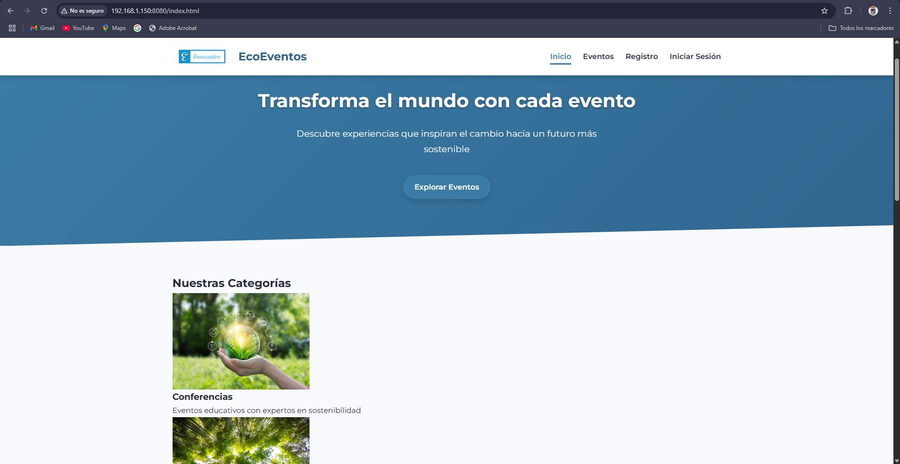

# Documentación Proyecto Minsait

- Este archivo es la documentación de mi proyecto; en él se explica cómo he solucionado cada apartado de la tarea e incluye algunas capturas de pantalla. También hay enlaces a distintos documentos en los cuales hay explicaciones más detalladas de cada apartado en caso de que sean necesarias. Además de eso, siguiendo la estructura recomendada, he guardado en el repositorio todos los archivos que he creado y utilizado; estos se encuentran en los directorios [/doc](doc), [/sql](sql), [/html](html) y [/src](src).

## Lenguaje de marcas

- El primer paso fue crear la página principal. Lo primero que se ve es el menú de arriba a la derecha; pulsando en cualquiera de los botones se puede ir a cualquiera de las otras páginas. Al final de la página, debajo de cuatro entradas con imágenes, se puede ver el carrusel con tres eventos destacados.

- Al pulsar en el evento del carrusel, se muestra la página de detalles del evento, que incluye información acerca del mismo, pudiendo ver la fecha, su ubicación, entre otras cosas.

- También se puede acceder a la página de Eventos pulsando en el menú; en ella se muestran 6 eventos, de la misma manera que en el carrusel. Al pulsar el evento principal, que es el primero que se ve, aparecerá la página de detalles del evento.

- Por último, dejo un enlace al documento donde se muestran capturas de pantalla de todas las partes de la página web → [Página Web completa](doc/VisualizacionPaginaWeb.pdf)

## Base de datos

- En este apartado, después de leer varias veces el enunciado, saqué las entidades y sus atributos. En el documento de [Modelo_Entidad-Relación_Eventos.pdf](doc/Modelo_Entidad-Relación_Eventos.pdf) se pueden ver las tablas para cada entidad con la información de los atributos.

- Una vez creadas las tablas usando el programa draw.io, he creado el diagrama de las relaciones entre las distintas tablas.

- Por último, usando como referencia el diagrama, he creado el archivo [CreacionBBDD_Eventos.sql](sql/CreacionBBDD_Eventos.sql) que contiene el SQL para crear la base de datos.

## Programación

- En la parte de programación he creado las seis clases que se necesitaban, cada una corresponde a las tablas de la base de datos, cada clase tiene sus métodos propios. Estas clases se encuentran en  [src/main/java](src/main/java); además de las clases en [src/test/java](src/test/java), hay test hechos para cada una de las clases.

## Sistemas informáticos

- Para la parte de sistemas informáticos he creado un contenedor con Docker que contiene un Apache, todo esto montado en un Alpine Linux, he utilizado un Alpine en vez de un Ubuntu ya que consume menos recursos, estas son las especificaciones de la máquina virtual.

- Una vez montada y configurada la máquina, lo que he hecho ha sido utilizar un script para crear el contenedor de Apache. Al ejecutarlo se crea el contenedor y las rutas necesarias para poder subir los archivos y verlos desde la máquina real.

- Por último, se puede ver la captura de pantalla de la máquina real accediendo desde el navegador a la página web, poniendo la IP y el puerto; en mi caso, la dirección era *192.168.1.150:8080* y al ponerla me salía directamente la página de inicio.

- Para ver todos los detalles de la creación y la configuración tanto de la máquina como del contenedor de Docker, en el archivo [ServidorWebAlpine_Documentacion.pdf](doc/ServidorWebAlpine_Documentacion..pdf) está todo explicado con más detalle.

## Entornos de desarrollo

- Como se pedía en el apartado de entornos, toda la información, documentos y recursos los he guardado en un repositorio de GitHub. lo primero fue crear el repositorio; en él creé la rama main y toda la estructura de las carpetas. A partir de ahí hice una rama para cada apartado del proyecto como se puede ver en el grafo. Cada vez que quería cambiar algo, lo cambiaba en su rama para no tocar directamente la principal hasta que fuese a subir cambios definitivos.

## Conclusión

- El resultado final del proyecto es poder acceder desde mi máquina real a la página alojada en el servidor Apache de la máquina virtual, como se puede ver en la última captura.

---

***Autor: Alberto Jociles Ortega***

